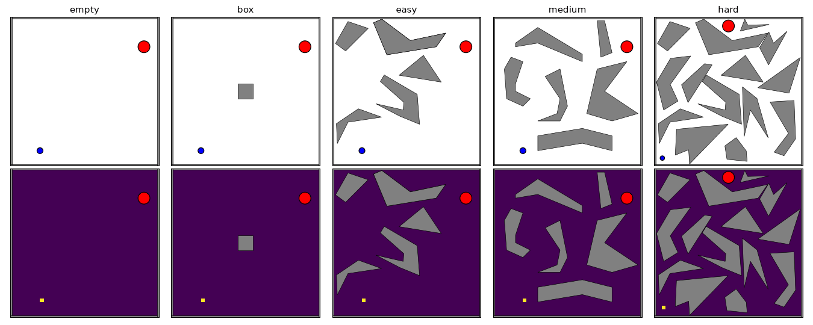

# pinball-jax

A JAX implementation of the Pinball reinforcement learning environment: a ball
driven by cardinal-direction impulses and drag, bouncing off polygon obstacles,
with the episode terminating when it reaches a circular target. `reset` and
`step` are pure functions and are fully JIT- and vmap-able.

This project is a JAX re-implementation of the Pinball environment originally
introduced in [1]. It has recently been used to evaluate Goal-Space Planning
[2], a subgoal model planning method, and Endpoint Replay [3], a replay buffer
compression method.

## References

[1] Konidaris, G. D., & Barto, A. G. (2009). [Skill Discovery in Continuous
Reinforcement Learning Domains using Skill Chaining](https://proceedings.neurips.cc/paper/2009/hash/e0cf1f47118daebc5b16269099ad7347-Abstract.html).
*Advances in Neural Information Processing Systems*, 22, 1015–1023.

[2] Lo, C., Roice, K., Panahi, P. M., Jordan, S., White, A., Mihucz, G.,
Aminmansour, F., & White, M. (2024). [Goal-Space Planning with Subgoal Models](https://jmlr.org/papers/v25/24-0040.html).
*Journal of Machine Learning Research*, 25(330), 1–57.

[3] Panahi, P. M., Ashrafi, A., Du, H., Patterson, A., White, M., & White, A.
(2026). [Endpoint Replay: Compressing the Recency Buffer in Deep Reinforcement
Learning](https://arxiv.org/abs/2607.25123). *Reinforcement Learning Journal*.

## Usage

Add it to your project with [uv](https://docs.astral.sh/uv/):

```sh
uv add git+https://github.com/panahiparham/pinball-jax
```

```python
import jax
from pinball_jax import Pinball, PinballParams

env = Pinball("box")  # bundled config name, or a path to a .cfg file
params = PinballParams(max_steps_in_episode=100)

key = jax.random.PRNGKey(0)
obs, state = env.reset(key)

# obs = [x, y, xdot, ydot]
# actions: 0 = +x, 1 = +y, 2 = -x, 3 = -y, 4 = no force
obs, state, reward, terminated, truncated, info = env.step(key, state, 0, params)
```

See [`example.py`](example.py) for a jitted `lax.scan` rollout.

### Visualizing behavior

[`pinball_jax.visualization`](src/pinball_jax/visualization.py) records and
renders agent behavior; it needs `matplotlib` (`uv sync --group viz`, or the
`benchmark` group, which already includes it):

```python
import jax
from pinball_jax import Pinball
from pinball_jax.visualization import (
    TransitionRecorder, record_rollout, save_behavior_gif, save_occupancy_heatmap_gif,
)

env = Pinball("easy")
recorder = TransitionRecorder()
record_rollout(env, jax.random.key(0), recorder, max_steps=400)  # uniform-random policy by default
trajectory = recorder.trajectory()

save_behavior_gif(env, trajectory, "behavior.gif")
save_occupancy_heatmap_gif(env, trajectory, "occupancy.gif")
```

`TransitionRecorder.record` is a thin `jax.experimental.io_callback` wrapper,
so it can also be called from inside a jitted interaction loop of your own (a
training loop's `lax.scan`/`while_loop` body) to capture transitions without
breaking `jit`.

## Environment

An observation is `[x, y, xdot, ydot]`: position in the unit square `[0, 1]^2`
(the same coordinate system obstacles, the start, and the target are defined
in) and velocity, clipped to `[-1, 1]` per axis.

There are 5 discrete actions: accelerate `+x`, accelerate `+y`, accelerate
`-x`, accelerate `-y`, or apply no force. Each of the four thrust actions adds
a fixed impulse (clipped so velocity stays in `[-1, 1]`) on the first of the 20
physics substeps that make up one `step` call.

Reward is -1 every step, so an episode's return is exactly -(its length): the
sooner the ball reaches the target, the higher (closer to 0) the return.

An episode terminates once the ball's center comes within the target's radius
of the target position, and truncates after `max_steps_in_episode` steps
regardless (1000 by default).

Each `step` runs 20 physics substeps. Drag (a 0.995 multiplicative decay per
step) and boundary clamping are applied once, after the substeps (skipped if
the ball reached the target that step). Colliding with a polygon obstacle
reflects velocity off the edge it hit; hitting a corner (two edges at once)
negates velocity outright.

### Variants

Five domains are bundled and selectable by name: `empty`, `box`, `easy`,
`medium`, `hard` (see [`src/pinball_jax/configs/`](src/pinball_jax/configs/)).
They share the same physics and differ only in their obstacles, start, and
target: `empty` has no interior obstacles, `box` adds a single small block,
and `easy`/`medium`/`hard` are progressively denser mazes.

The animation below runs a uniform-random policy on each variant for one
episode: ball behavior on top, the resulting state-occupancy heatmap
(aggregated over the velocity dimensions) on the bottom.



Regenerate with:

```sh
uv run --group viz python make_variants_gif.py
```

## Benchmarks

[`benchmark_dqn.py`](benchmark_dqn.py) trains a small DQN and a uniform-random
agent on Pinball `easy` for 100k timesteps across 30 seeds (each agent is a
single `jax.vmap` over seeds), then plots mean episodic return over time with
95% bootstrap confidence bands, alongside one seed's state-occupancy heatmap
over its entire training lifetime for each agent.
single `jax.vmap` over seeds), then plots mean episodic return over time with
95% bootstrap confidence bands, alongside one seed's state-occupancy heatmap
over its entire training lifetime for each agent.


(vector version: [`benchmark_dqn.pdf`](benchmark_dqn.pdf))

Run it with:

```sh
uv run --group benchmark python benchmark_dqn.py
```

Default DQN hyperparameters for Pinball `easy`:

| Hyperparameter        | Value        |
| --------------------- | ------------ |
| Learning rate         | 0.002        |
| Optimizer             | Adam         |
| Replay buffer size    | 10,000       |
| Batch size            | 32           |
| Learning starts       | 1,000 steps  |
| Target refresh        | every 100 steps (hard copy) |
| Discount (`gamma`)    | 0.99         |
| Epsilon (constant)    | 0.1          |
| Hidden layers         | 2 × 32 (ReLU) |

## Throughput

These measure environment steps per second on CPU. Compilation time is excluded.
The numbers below were measured on an Apple M1 CPU with 8 cores.

Run with:

```sh
uv run --group benchmark python benchmark_throughput.py
```

**Environment throughput, random policy**

The vmapped rows count total steps across all environments. Step count per
config is chosen to bound wall-clock time (steps/sec is a rate, independent of
step count once compiled): collision detection against several polygon
obstacles doesn't vectorize as cheaply across a wide vmap batch as e.g. a
simple grid update, so larger environment counts use fewer steps.

| Implementation | Environments | Steps/sec | Speedup vs. numpy |
| --- | --- | --- | --- |
| reference (numpy) | 1 | 6,224 | 1x |
| pinball-jax | 1 | 34,400 | 5.5x |
| pinball-jax | 8 | 75,100 | 12x |
| pinball-jax | 64 | 45,000 | 7.2x |
| pinball-jax | 512 | 53,300 | 8.6x |
| pinball-jax | 4096 | 103,000 | 17x |

**Agent throughput on pinball-jax**

Measured at one seed, so each row is a single agent stepping its own environment
with its own replay buffer. Multi-seed runs scale by vmapping over independent
streams like these rather than by batching environments under one agent.

| Agent | Steps/sec |
| --- | --- |
| Random | 32,900 |
| DQN | 18,100 |
