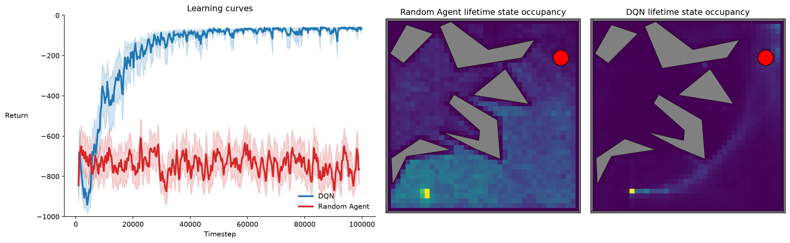

# pinball-jax

A JAX implementation of the Pinball reinforcement learning environment: a ball
driven by cardinal-direction impulses and drag, bouncing off polygon obstacles,
with the episode terminating when it reaches a circular target. `reset` and
`step` are pure functions and are fully JIT- and vmap-able.

This project is a JAX re-implementation of the Pinball environment originally
introduced in [1]. It has recently been used to evaluate Goal-Space Planning
[2], a subgoal model planning method, and Endpoint Replay [3], a replay buffer
compression method.

## References

[1] Konidaris, G. D., & Barto, A. G. (2009). [Skill Discovery in Continuous
Reinforcement Learning Domains using Skill Chaining](https://proceedings.neurips.cc/paper/2009/hash/e0cf1f47118daebc5b16269099ad7347-Abstract.html).
*Advances in Neural Information Processing Systems*, 22, 1015–1023.

[2] Lo, C., Roice, K., Panahi, P. M., Jordan, S., White, A., Mihucz, G.,
Aminmansour, F., & White, M. (2024). [Goal-Space Planning with Subgoal Models](https://jmlr.org/papers/v25/24-0040.html).
*Journal of Machine Learning Research*, 25(330), 1–57.

[3] Panahi, P. M., Ashrafi, A., Du, H., Patterson, A., White, M., & White, A.
(2026). [Endpoint Replay: Compressing the Recency Buffer in Deep Reinforcement
Learning](https://arxiv.org/abs/2607.25123). *Reinforcement Learning Journal*.

## Installation

Add it to your project with [uv](https://docs.astral.sh/uv/):

```sh
uv add git+https://github.com/panahiparham/pinball-jax
```

## Usage

```python
import jax
from pinball_jax import Pinball, PinballParams

env = Pinball("box")  # bundled config name, or a path to a .cfg file
params = PinballParams(max_steps_in_episode=100)

key = jax.random.PRNGKey(0)
obs, state = env.reset(key)

# obs = [x, y, xdot, ydot]
# actions: 0 = +x, 1 = +y, 2 = -x, 3 = -y, 4 = no force
obs, state, reward, terminated, truncated, info = env.step(key, state, 0, params)
```

Five domains are bundled and selectable by name: `empty`, `box`, `easy`,
`medium`, `hard`. See [`example.py`](example.py) for a jitted `lax.scan` rollout.

## Benchmark

[`benchmark_dqn.py`](benchmark_dqn.py) trains a small DQN and a uniform-random
agent on Pinball `easy` for 100k timesteps across 30 seeds (each agent is a
single `jax.vmap` over seeds). Since reward is -1 per step, an episode's return
is minus its length, so higher (closer to 0) means the ball reaches the goal
faster; the plot below shows mean episodic return over time with 95% bootstrap
confidence bands.



(vector version: [`benchmark_dqn.pdf`](benchmark_dqn.pdf))

Run it with:

```sh
uv run --group benchmark python benchmark_dqn.py
```

Default DQN hyperparameters for Pinball `easy`:

| Hyperparameter        | Value        |
| --------------------- | ------------ |
| Learning rate         | 0.002        |
| Optimizer             | Adam         |
| Replay buffer size    | 10,000       |
| Batch size            | 32           |
| Learning starts       | 1,000 steps  |
| Target refresh        | every 100 steps (hard copy) |
| Discount (`gamma`)    | 0.99         |
| Epsilon (constant)    | 0.1          |
| Hidden layers         | 2 × 32 (ReLU) |
